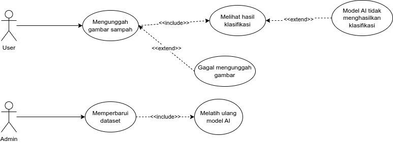
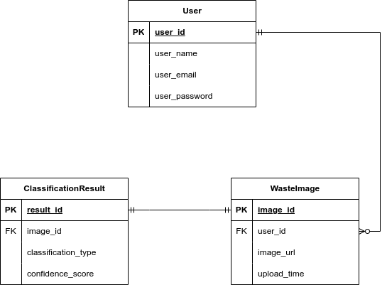
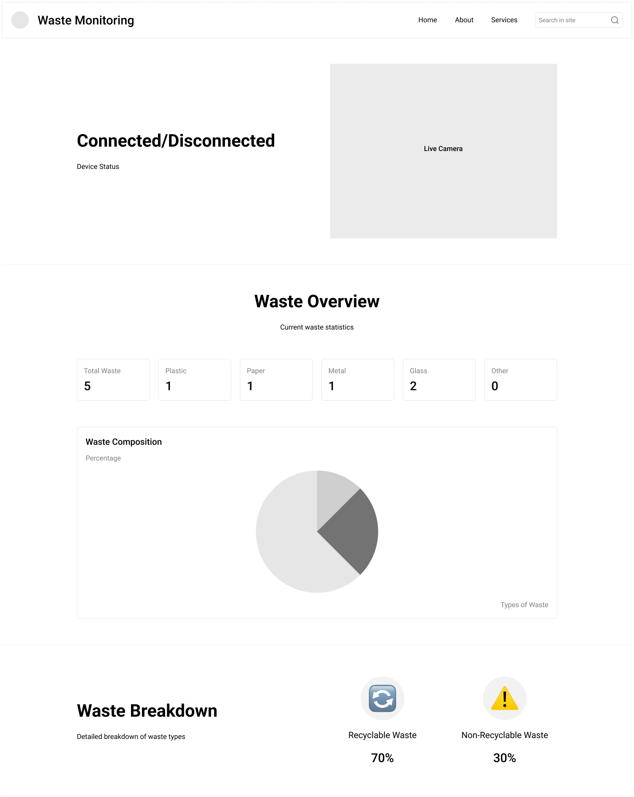
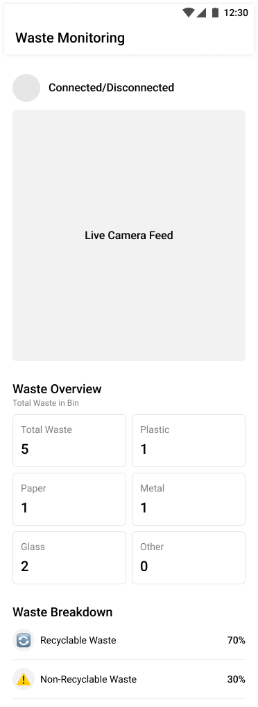

# **PROYEK SENIOR TI** 📌

📍 **Departemen Teknologi Elektro dan Teknologi Informasi, Fakultas Teknik, Universitas Gadjah Mada**

---

=======
## **👥 Anggota Tim**

### **Benaya Imanuela**

- 🆔 **NIM:** 22/494790/TK/54313
- 🏆 **Role:** UI/UX Designer, Software Engineer 🎨💻

### **Nur Rochman**

- 🆔 **NIM:** 22/493623/TK/54086
- 🏆 **Role:** AI Engineer, Cloud Engineer 🤖☁️
- **Address:** Sleman, Yogyakarta (tambahan readme untuk keperluan inhal)

---

## **📌 Nama Produk:** **Sortify**

🖥️ **Jenis Produk:** Layanan Software untuk mengelola proses penyortiran sampah secara otomatis

---

## **🌍 Latar Belakang**

♻️ **Masalah Pengelolaan Sampah:**

- Sampah yang tidak terpilah dengan baik masih menjadi **masalah utama** dalam pengelolaan lingkungan.
- Kurangnya **edukasi** dan **fasilitas** menyebabkan sampah organik, anorganik, dan bahan berbahaya bercampur.
- Pemilahan manual masih kurang efektif dan berkontribusi terhadap peningkatan **volume sampah di TPA**.

💡 **Solusi yang Dibutuhkan:**

- Teknologi **berbasis AI** yang bisa membantu masyarakat memilah sampah dengan **mudah dan cepat**.
- Sistem yang mampu mengenali jenis sampah melalui **image processing**.
- Hasil klasifikasi ditampilkan dalam **antarmuka web** sehingga dapat diakses dari berbagai perangkat dengan **koneksi internet**.

---

## **❓ Rumusan Permasalahan**

1️⃣ **Bagaimana mengembangkan model AI berbasis image processing yang dapat mengenali dan mengklasifikasikan sampah dengan akurat?**  
2️⃣ **Bagaimana merancang sistem berbasis jaringan komputer yang memungkinkan pengguna mengakses layanan klasifikasi sampah secara real-time?**  
3️⃣ **Bagaimana mengintegrasikan AI dengan layanan cloud agar pemrosesan gambar dan penyimpanan data efisien serta dapat diakses kapan saja?**  
4️⃣ **Bagaimana memastikan aplikasi web memiliki antarmuka yang ramah pengguna serta dapat diakses di berbagai perangkat dan jaringan?**

---

## **🚀 Solusi yang Ditawarkan**

✅ **AI untuk Klasifikasi Sampah:**

- Menggunakan **model klasifikasi** untuk membedakan sampah yang **dapat didaur ulang dan tidak**.

✅ **Deploy Backend dan AI di Cloud:**

- Model AI dan kode backend **di-deploy di cloud** agar dapat diakses melalui **REST API/WebSocket** oleh frontend.

✅ **Koneksi dengan Perangkat Keras:**

- Frontend berjalan di **lokal/Raspberry Pi** dan terkoneksi dengan **ESP32** melalui koneksi **serial** untuk menggerakkan **servo**.
- **Servo bergerak** berdasarkan input kamera yang diproses oleh model AI:
  - **0 → kiri (sampah tidak bisa didaur ulang)**
  - **1 → kanan (sampah bisa didaur ulang)**
  - **Default: tengah**

✅ **Potensi Implementasi:**

- **B2B (Business-to-Business)** → Membantu **perusahaan** atau **pemerintah** dalam mengelola sampah secara lebih optimal.

---

## **🔧 Rancangan Fitur Solusi**

| 🛠️ **Fitur**                | 📜 **Keterangan**                                                                             |
| --------------------------- | --------------------------------------------------------------------------------------------- |
| 📸 **Klasifikasi Sampah**   | Membedakan mana sampah yang dapat didaur ulang dan tidak berdasarkan input gambar             |
| 📊 **Dashboard Monitoring** | Mengakumulasi total sampah dan persentase yang dapat didaur ulang untuk analisis lebih lanjut |

---

## **⚖️ Analisis Kompetitor**

### **🛠️ KOMPETITOR 1: Trashbot by CleanRobotics**

🗂 **Jenis:** Direct Competitor  
📌 **Jenis Produk:** Smart Trash Bin berbasis AI

🎯 **Target Customer:**

- Perusahaan dan institusi yang ingin menerapkan **teknologi daur ulang otomatis**.
- Pemerintah daerah dengan konsep **smart city**.

💪 **Kelebihan:**  
✔️ Teknologi AI dapat memilah sampah secara **real-time**.  
✔️ Terintegrasi dengan **sistem smart waste management**.  
✔️ Meminimalisir kesalahan manusia dalam memilah sampah.

❌ **Kekurangan:**

- Produk berbentuk **hardware**, bukan aplikasi web.
- Harga **mahal** dan sulit diimplementasikan di **rumah tangga**.
- Tidak tersedia di semua negara.

🔥 **Unique Value Proposition:**  
✅ **Sistem pemilahan sampah berbasis AI** tetapi kurang fleksibel karena berbentuk hardware dengan harga mahal.

---

### **🛠️ KOMPETITOR 2: EcoBin**

🗂 **Jenis:** Direct Competitor  
📌 **Jenis Produk:** Tempat Sampah Pintar berbasis AI dan IoT

🎯 **Target Customer:**

- **Pemerintah kota** yang ingin meningkatkan efisiensi pengelolaan sampah.
- **Komunitas** dan **institusi** yang peduli terhadap lingkungan.

💪 **Kelebihan:**  
✔️ **Pemilahan sampah otomatis** menggunakan sensor dan pemrosesan data.  
✔️ **Pemantauan kapasitas tempat sampah** secara real-time.  
✔️ Mendukung **pengelolaan sampah yang efisien**.

❌ **Kekurangan:**

- Memerlukan **investasi infrastruktur** untuk implementasi.
- Fokus pada **hardware**, kurang fleksibel dibandingkan solusi berbasis **aplikasi**.

🔥 **Unique Value Proposition:**  
✅ **Integrasi AI dan IoT dalam bentuk fisik** untuk pemilahan sampah otomatis.

---

### **🛠️ KOMPETITOR 3: SMASH (Smart Mobile Application for Smart Handling)**

🗂 **Jenis:** Direct Competitor  
📌 **Jenis Produk:** Aplikasi Manajemen Sampah Berbasis Mobile

🎯 **Target Customer:**

- **Masyarakat umum** yang ingin terhubung dengan **bank sampah**.
- **Pemerintah daerah** yang membutuhkan sistem manajemen sampah.

💪 **Kelebihan:**  
✔️ **Menghubungkan pengguna** dengan **bank sampah terdekat**.  
✔️ Menyediakan informasi **jenis sampah yang diterima** oleh bank sampah.  
✔️ Fitur **e-Smash** untuk manajemen sampah di tingkat pemerintah daerah.

❌ **Kekurangan:**

- **Tidak memiliki fitur pemilahan sampah otomatis berbasis AI**.
- Bergantung pada **partisipasi aktif** dari bank sampah dan pengguna.

🔥 **Unique Value Proposition:**  
✅ **Menghubungkan masyarakat dengan bank sampah** melalui aplikasi mobile.

📌 **Tabel perbandingan:**  

| **Fitur**                   | **Sortify** | **Trashbot** | **EcoBin** | **SMASH** |
| --------------------------- | ----------- | ------------ | ---------- | --------- |
| AI untuk Klasifikasi Sampah | ✅ Ya       | ✅ Ya        | ✅ Ya      | ❌ Tidak  |
| Dapat Digunakan di Rumah    | ✅ Ya       | ❌ Tidak     | ❌ Tidak   | ✅ Ya     |
| Harga Akses Terjangkau      | ✅ Ya       | ❌ Mahal     | ❌ Mahal   | ✅ Ya     |
| Berbasis Cloud & Web        | ✅ Ya       | ❌ Tidak     | ❌ Tidak   | ✅ Ya     |
| Mudah Dikembangkan          | ✅ Ya       | ❌ Tidak     | ❌ Tidak   | ✅ Ya     |

---

### **📌 Metodologi SDLC (Software Development Life Cycle) dan Alasan Pemilihan**

Dalam pengembangan **Sortify**, kami menggunakan **Metodologi Agile (Scrum)** karena:

- ✅ Angile sangat cocok untuk proyek yang bersifat berkelanjutan dan membutuhkan **fleksibilitas tinggi**.
- ✅ Agile memungkinkan tim untuk **beradaptasi dengan perubahan secara cepat** serta merespons kebutuhan yang dinamis.
- ✅ Agile ideal untuk proyek dengan **requirement yang masih belum sepenuhnya** jelas atau dapat berubah seiring waktu, sehingga pengembangan dapat dilakukan secara iteratif dan kolaboratif.

---

### **🎯 Tujuan Produk**

- ✅ Produk ini dirancang untuk mengoptimalkan pengelolaan sampah dengan teknologi computer vision yang mampu mengidentifikasi dan mengklasifikasikan sampah secara otomatis menjadi kategori yang dapat didaur ulang atau tidak.
- ✅ Dengan sistem ini, pemerintah dan perusahaan dapat lebih mudah dalam mengelola limbah secara efisien serta meningkatkan tingkat daur ulang. Selain itu, produk ini juga mengumpulkan data terkait jenis dan volume sampah yang kemudian dapat dianalisis melalui platform web untuk mendukung pengambilan keputusan yang lebih berbasis data.

### **👤 Pengguna Potensial & Kebutuhan Pengguna**

| **Tipe Pengguna**                               | **Kebutuhan Utama**                                                                                                    |
| ----------------------------------------------- | ---------------------------------------------------------------------------------------------------------------------- |
| **Pemerintah & Dinas Lingkungan Hidup** 🏛️      | Membantu dalam optimalisasi pengelolaan sampah dan peningkatan efisiensi daur ulang.                                   |
| **Perusahaan pengelola sampah & daur ulang** 🏢 | Mendukung pengelolaan limbah dengan otomatisasi dan analisis data untuk meningkatkan efektivitas pemrosesan sampah.    |
| **Mall, Perkantoran, dan Tempat Umum** 🏠       | Mengurangi kontaminasi sampah dan meningkatkan tingkat pemilahan sejak awal.                                           |
| **Lembaga riset & akademisi** 🌿                | Memanfaatkan data yang dikumpulkan untuk penelitian tentang pola pembuangan sampah dan efektivitas program daur ulang. |

---

## **📌 Use Case Diagram dan Penjelasan**

### **📊 Use Case Diagram**

Berikut adalah diagram **use case** dari aplikasi **Sortify**:

### **📜 Penjelasan Singkat**

1. Use case diagram ini menunjukkan interaksi antara aktor dan sistem Sortify.
2. Terdapat dua aktor utama: User dan Admin.

- User mengunggah gambar sampah dan melihat hasil klasifikasi. Jika pengunggahan gagal, sistem menampilkan pesan error. Jika hasil klasifikasi tidak valid, sistem meminta pengguna mencoba lagi.
- Admin memperbarui dataset gambar dan melatih ulang model AI untuk meningkatkan akurasi klasifikasi.

3. Use case ini adalah rancangan awal yang akan berkembang seiring waktu.

---

## **📝 Functional Requirements**

Berikut adalah beberapa **requirement fungsional utama** berdasarkan **use case** yang telah dirancang:

| **ID** | **Deskripsi**                                                                                                                                                          |
| ------ | ---------------------------------------------------------------------------------------------------------------------------------------------------------------------- |
| FR-01  | Sistem harus memungkinkan pengguna untuk mengunggah gambar sampah melalui antarmuka web.                                                                               |
| FR-02  | Sistem harus menyimpan informasi gambar yang diunggah, termasuk URL gambar, waktu unggah, dan ID pengguna yang terkait.                                                |
| FR-03  | Sistem harus mengklasifikasikan gambar sampah yang diunggah menjadi kategori yang dapat didaur ulang atau tidak maupun kategori lain sesuai dengan model yang dilatih. |
| FR-04  | Sistem harus menampilkan hasil klasifikasi kepada pengguna, termasuk jenis sampah dan tingkat kepercayaan (confidence score).                                          |
| FR-05  | Sistem harus mengakumulasi total jumlah sampah yang diunggah oleh pengguna dalam fitur "Waste Overview".                                                               |
| FR-06  | Sistem harus menampilkan komposisi sampah dalam bentuk persentase berdasarkan kategori sampah pada bagian "Waste Composition".                                         |
| FR-07  | Sistem harus membedakan antara sampah yang dapat didaur ulang dan yang tidak pada bagian "Waste Breakdown", dengan persentase yang sesuai.                             |
| FR-08  | Sistem harus memiliki fitur live camera yang memungkinkan pengguna untuk melihat video langsung dari proses klasifikasi.                                               |
| FR-09  | Sistem harus memungkinkan admin untuk melatih ulang model AI berdasarkan dataset terbaru.                                                                              |
| FR-10  | Jika proses klasifikasi gagal, sistem harus menampilkan notifikasi kegagalan kepada pengguna dan meminta pengunggahan ulang gambar.                                    |
| FR-11  | Sistem harus memastikan keamanan data pengguna, termasuk enkripsi password dan perlindungan akses data pribadi.                                                        |

---

## **📌 Entity-Relationship Diagram (ERD) dan Penjelasan**

### **📊 ERD untuk Sortify**

### **📜 Penjelasan Singkat**

- ERD ini menggambarkan struktur basis data Sortify dengan tiga entitas utama: User, WasteImage, dan ClassificationResult.
- Tabel User menyimpan informasi pengguna dengan atribut user_id (primary key), user_name, user_email, dan user_password.
- Setiap pengguna dapat mengunggah banyak gambar sampah yang dikelola dalam tabel WasteImage, yang memiliki atribut image_id (primary key), user_id (foreign key ke tabel User), image_url, dan upload_time.
- Hasil klasifikasi gambar disimpan dalam tabel ClassificationResult dengan atribut result_id (primary key), image_id (foreign key ke tabel WasteImage), classification_type, dan confidence_score.
- ERD ini menunjukkan alur dari pengunggahan gambar, klasifikasi, hingga penyimpanan hasilnya dan akan berkembang seiring waktu.

---

## **📌 Low Fidelity Wireframe untuk Laptop/Tablet dan HP**

1. Versi Laptop / Tablet

- 

2. Versi HP

- 

### **📜 Penjelasan Wireframe**

1. Fitur untuk menampilkan apakah device kamera tersambung atau tidak
2. Fitur untuk menampilkan output dari kamera yang digunakan untuk mendeteksi objek
3. Fitur untuk menampilkan total dan jenis sampah yang berada di dalam tempat sampah
4. Fitur untuk menampilkan persentase sampah yang dapat didaur ulang dan tidak

---

## **📌 Gantt Chart (Jadwal Pengembangan 12 Minggu)**

| **Kegiatan**          | 1   | 2   | 3   | 4   | 5   | 6   | 7   | 8   | 9   | 10  | 11  | 12  |
| --------------------- | --- | --- | --- | --- | --- | --- | --- | --- | --- | --- | --- | --- |
| **Brainstorming**     | 🔴  | 🔴  | 🔴  | 🔴  |     |     |     |     |     |     |     |     |
| **UI/UX Designing**   |     |     | 🔴  | 🔴  |     |     |     |     |     |     |     |     |
| **Frontend Dev**      |     |     | 🟡  | 🟡  | 🟡  | 🟡  | 🟡  |     |     |     |     |     |
| **Backend Dev**       |     |     |     | 🟢  | 🟢  | 🟢  | 🟢  | 🟢  |     |     |     |     |
| **AI Model Training** |     |     | 🟣  | 🟣  | 🟣  | 🟣  | 🟣  |     |     |     |     |     |
| **Cloud Deployment**  |     |     |     |     |     |     | 🔵  | 🔵  | 🔵  | 🔵  | 🔵  |     |

---

## 📌 Penjelasan Gantt Chart

1. **Brainstorming (Minggu 1-4)**

   - Semua anggota tim terlibat dalam diskusi dan penyusunan konsep awal proyek.

2. **UI/UX Designing (Minggu 3-4)**

   - Mendesain wireframe dan iterasi desain sebelum implementasi.

3. **Frontend Development (Minggu 3-7)**

   - Pengembangan tampilan aplikasi berbasis web dan integrasi UI/UX.

4. **Backend Development (Minggu 4-8)**

   - Membangun API dan sistem server untuk mendukung klasifikasi sampah.

5. **AI Model Training (Minggu 3-7)**

   - Melatih model klasifikasi sampah berbasis **computer vision**.

6. **Cloud Deployment (Minggu 7-11)**
   - Men-deploy model AI ke cloud dan mengintegrasikannya dengan web.

---

## **💡 Kesimpulan**

**Sortify** hadir sebagai **solusi inovatif** berbasis **AI, cloud computing, dan IoT** yang dapat membantu masyarakat memilah sampah secara **otomatis dan efisien**. Dengan solusi ini, kami berharap dapat meningkatkan **kesadaran masyarakat** dalam memilah sampah serta membantu **pemerintah dan perusahaan** dalam mengelola sampah dengan lebih optimal! 🚀🌱

---

## **📚 Referensi**

1. Sitinut Waisara. (2025, Februari 15). Smart Trash Bin with Waste separator. YouTube. [https://youtu.be/33T43l-gu78?si=5xhUgkeN2CLo4s3u](https://youtu.be/33T43l-gu78?si=5xhUgkeN2CLo4s3u)

2. Yusuf, Y. Y. N., Arbaatun, C. N., & Prawita, F. N. (2020). MATRASH: Pemanfaatan machine learning pada smart trash bin berbasis IoT yang terintegrasi dengan bank sampah. Universitas Telkom. Diakses dari [https://openlibrary.telkomuniversity.ac.id/pustaka/files/162087/jurnal_eproc/matrash-pemanfaatan-machine-learning-pada-smart-trash-bin-berbasis-iot-yang-terintegrasi-dengan-bank-sampah.pdf](https://openlibrary.telkomuniversity.ac.id/pustaka/files/162087/jurnal_eproc/matrash-pemanfaatan-machine-learning-pada-smart-trash-bin-berbasis-iot-yang-terintegrasi-dengan-bank-sampah.pdf)

---
